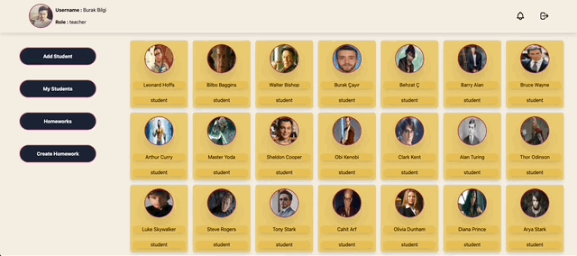
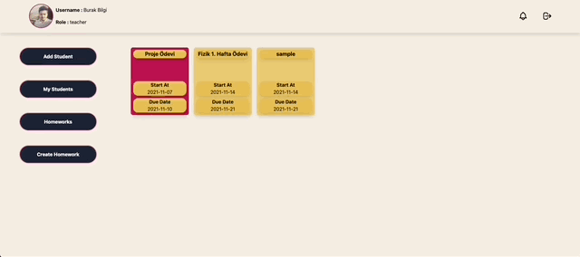
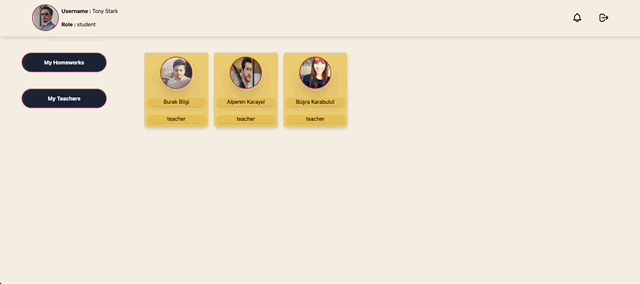

<h1 align="center">
    Homework Tracking Platform
</h1>

<p align="center">
  
</p>

## Description

Homework Tracking Platform based on 3 basic roles.

1. Student:
   - View all the homeworks that are assigned to him/her.
   - Color coded homeworks based on the due date of the homework.
   - View homework details.
   - Submit homework
   - View all teachers who are assigned to him/her.
   - View teachers details.
2. Teacher:
   - Create homework (title,summary,description,start date,due date,file)
   - View all homeworks that are created by him/her.
   - Color coded homeworks based on the due date of the homework.
   - View homeWork details.
   - View all students that are submitted under homework details.
   - View submission details.
   - View all students
   - View student details.
   - Add students
   - View all assigned students
   - Delete assigned students
3. Principle:
   - View all teachers
   - View teachers details.
   - View all students that are assigned to him/her under the details.
   - View all homeworks
   - Color coded homeworks based on the due date of the homework.
   - View homework details.

## How to install

```Bash
git clone https://github.com/burakkisacik/homework-tracking-platform.git
```

```Bash
 cd homework-tracking-platform
 npm install
 npm start
```

## How to use

> To login as a student

- email : tony@gmail.com
- password : tony123

> To login as a teacher

- email : burak@gmail.com
- password : burak123

> To login as a principle

- email : ziya@gmail.com
- password : ziya123

**All users follows the same convention for login email and password. Once you login with above credentials you can see the other users in the app and connect their profile with the following convention...**

> Email : *name@gmail.com* <br/>
> Password : _name123_

## What is missing

1. Due to the limited time of the assignment
   - Clean code principles not implemented.
   - Couldn't properly design component structure of the app
   - Couldn't prepare the structure of the React app with Webpack and Eslint
   - Tailwind CSS has used for fast development.
   - Core functionalities are implemented but some side stylings and logics are missing.
2. Due to the first time usage of Firebase
   - There are some code duplication
   - There are some unnecessary database interactions. That can be fixed by some prop drillings.
3. For easy review
   - Firebase credentials are included in the repository. They are not hidden in .env.local file

## TODOs

- [ ] Add welcome page for all profiles
- [ ] In welcome page user can see announcements that given by top roles
- [ ] Component folder structure can be arrange by individual page's needs and some component can be reused
- [ ] Firebase functions can be refactored to prevent unnecessary database interactions
- [ ] Hide Firebase credentials in .env.local file
- [ ] Add Eslint and Webpack configurations
- [ ] Refactor some components styles like teachers submitted homework page

## Screenshots

1. Add Delete Student
<p align="center">
  
</p>

2. See Homework Details - Submitted Student and Their Submission
 <p align="center">
  
</p>

3. Submit A Homework
 <p align="center">
  
</p>
