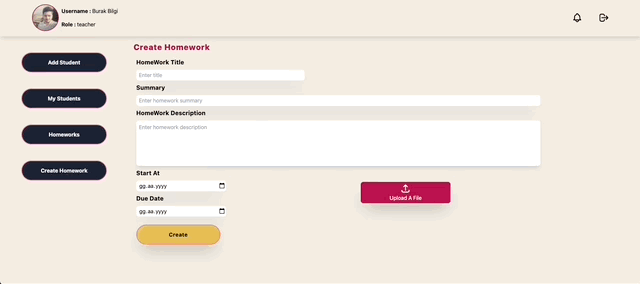

<h1 align="center">
    Homework Tracking Platform
</h1>

<p align="center">
  
</p>

## Description

Homework Tracking Platform based on 3 basic roles.

1. Student:
   - View all the homeworks that are assigned to him/her.
   - Color coded homeworks based on the due date of the homework.
   - View homework details.
   - Submit homework
   - View all teachers who are assigned to him/her.
   - View teachers details.
2. Teacher:
   - Create homework (title,summary,description,start date,due date,file)
   - View all homeworks that are created by him/her.
   - Color coded homeworks based on the due date of the homework.
   - View homeWork details.
   - View all students that are submitted under homework details.
   - View submission details.
   - View all students
   - View student details.
   - Add students
   - View all assigned students
   - Delete assigned students
3. Principle:
   - View all teachers
   - View teachers details.
   - View all students that are assigned to him/her under the details.
   - View all homeworks
   - Color coded homeworks based on the due date of the homework.
   - View homework details.

## How to use

```Bash
git clone https://github.com/burakkisacik/homework-tracking-platform.git
```

```Bash
 cd homework-tracking-platform
 npm install
 npm start
```
